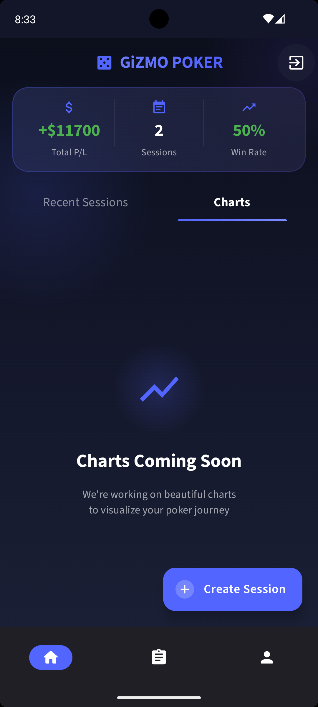
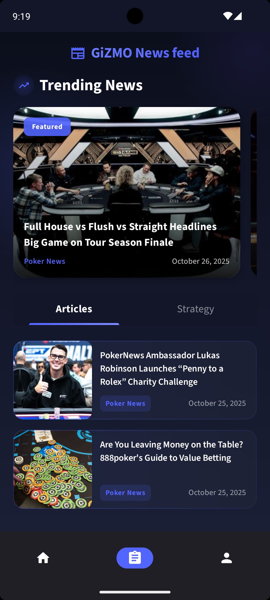

<h1>GizmoPoker</h1>


[](https://kotlinlang.org/docs/reference/multiplatform.html)


A Kotlin Multiplatform poker session tracker with support for Android, iOS, Desktop, and a backend server.

## Screenshots

| Sessions Screen | Charts Screen | News Feed Screen |
|:---:|:---:|:---:|
|  |  |  |

## Tech Stack

### Frontend
- **Kotlin Multiplatform** 2.2.21
- **Compose Multiplatform** 1.10.0
- **Ktor Client** 3.3.3 for API calls
- **Coil** 3.3.0 for image loading
- **Koin** 4.1.1 for dependency injection
- **SQLDelight** 2.2.1 for local database
- **kotlinx-datetime** for date/time handling

### Backend (Server)
- **Ktor Server** 3.3.3
- **jOOQ** 3.20.9 for type-safe SQL
- **Flyway** 11.18.0 for database migrations
- **SQLite** as the database
- **JWT** for authentication

## Project Structure

```
├── build-logic/         # Gradle convention plugins
│   └── convention/      # Shared build configuration
├── core/                # Core shared modules
│   ├── core-common/     # Utilities, extensions, base classes
│   ├── core-network/    # API client, network utilities
│   ├── core-database/   # SQLDelight database layer
│   ├── core-preferences/# Settings and preferences
│   ├── core-di/         # Koin DI setup
│   ├── core-ui/         # Theme, design system, shared components
│   └── core-resources/  # Shared resources (images, strings)
├── feature/             # Feature modules
│   ├── feature-auth/    # Login, signup, authentication
│   ├── feature-tracker/ # Session tracking
│   ├── feature-feed/    # News feed
│   └── feature-cards/   # Equity calculator, card games
├── composeApp/          # Main application (umbrella module)
│   ├── androidMain/     # Android-specific code
│   ├── desktopMain/     # Desktop-specific code
│   └── iosMain/         # iOS framework (GizmoCore)
├── server/              # Ktor backend server
├── common/              # Shared DTOs and models
├── evaluator/           # Poker hand evaluation logic
└── iosApp/              # iOS app wrapper
```

## Module Architecture


The project uses a **multi-module architecture** with convention plugins for consistent build configuration:

- **Convention Plugins**: `gizmo.kmp.library`, `gizmo.compose`, `gizmo.feature`, `gizmo.koin.ksp`
- **Core Modules**: Shared infrastructure used by all feature modules
- **Feature Modules**: Self-contained features with their own domain, data, and presentation layers
- **App Module**: Aggregates all modules and provides platform-specific entry points

## Features

- Track poker sessions with detailed statistics
- Multi-platform support (Android, iOS, Desktop)
- News feed with poker articles and strategy content
- User authentication with JWT
- Offline-first architecture with SQLDelight
- Type-safe database queries with jOOQ

